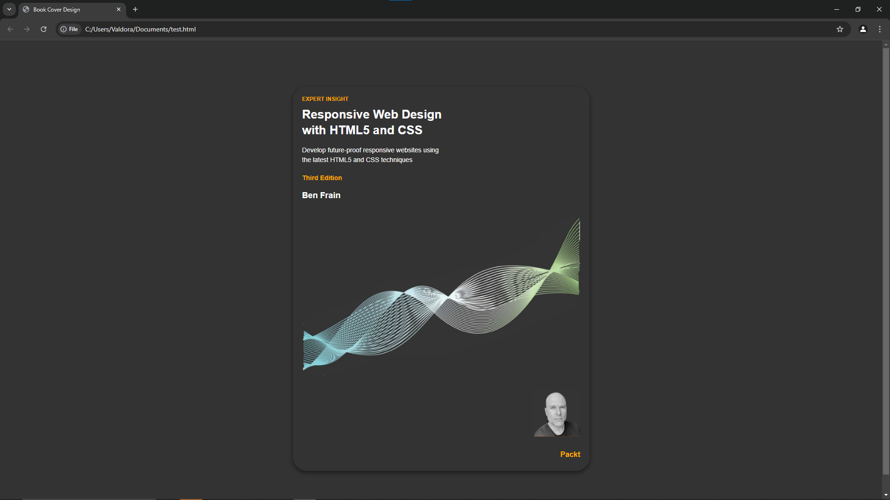

# Ex.06 Book Front Cover Page Design
## Date:
2/12/2024
## AIM:
To design a book front cover page using HTML and CSS.

## DESIGN STEPS:

### Step 1:
Create a Django Admin project.

### Step 2:
Create an app in the Django interface.

### Step 3:
Create a folder named 'static' in the app folder.

### Step 4:
Create a new HTML file in the static folder.

### Step 5:
Write the HTML code with relevant CSS properties.

### Step 6:
Choose the appropriate style and color scheme.

### Step 7:
Insert the images in their appropriate places.

### Step 8:
Publish the website in the LocalHost.

## PROGRAM:
```
<!DOCTYPE html>
<html>
<head>
    <title>Book Cover</title>
    <style>
        body {
            margin: 0;
            height: 100vh;
            display: flex;
            justify-content: center;
            align-items: center;
            background-color: #f0f0f0;
        }

        img {
            max-width: 100%;
            max-height: 100%;
        }
    </style>
</head>
<body>
    
</body>
</html>
```

## OUTPUT:


## RESULT:
The program for designing book front cover page using HTML and CSS is completed successfully.
